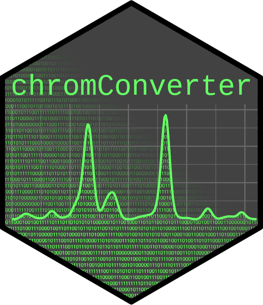

# chromConverter <a href='https://CRAN.R-project.org/package=chromConverter'></a>

<!-- badges: start -->
[](https://cran.r-project.org/package=chromConverter)
[](https://ethanbass.r-universe.dev)
[](https://doi.org/10.5281/zenodo.6944342)
[](https://r-pkg.org/pkg/chromConverter)
[](https://cran.r-project.org/package=chromConverter)
<!-- badges: end -->

**Table of contents:** [Overview](.#Overview) -
[Installation](.#Installation) - [File formats](.#Formats) - [Usage](.#Usage) - [Contributing](.#Contributing) - [Citation](.#Citation)

### Overview

chromConverter aims to facilitate the conversion of chromatography data from various proprietary formats so it can be easily read into R for further analysis. It includes a number of parsers written directly in R as well as bindings to various external libraries including [Aston](https://github.com/bovee/aston), [Entab](https://github.com/bovee/entab), [rainbow](https://rainbow-api.readthedocs.io/), the [ThermoRawFileParser](https://github.com/compomics/ThermoRawFileParser), [OpenChrom](https://lablicate.com/platform/openchrom) and [RaMS](https://github.com/wkumler/RaMS/).

### Formats

##### ChromConverter (internal parsers)
- 'Agilent ChemStation' & 'OpenLab' `.uv` files (versions 131, 31)
- 'Agilent ChemStation' & 'OpenLab' `.ch` files (versions 30, 130, 8, 81, 179, 181)
- Allotrope® Simple Model (ASM) 2D chromatograms (`.asm`)
- ANDI (Analytical Data Interchange) Chromatography & MS formats (`.cdf`)
- mzML (`.mzml`) & mzXML (.`mzxml`) (via *RaMS*).
- 'Shimadzu LabSolutions' ascii (`.txt`)
- 'Shimadzu GCsolution' data files (`.gcd`)
- 'Shimadzu GCMSsolution' data files (`.qgd`) 
- 'Shimadzu LabSolutions'`.lcd` (*provisional support* for PDA, chromatogram, and peak table streams)
- 'Thermo Scientific Chromeleon' ascii (`.txt`)
- 'Varian Workstation' (`.SMS`)
- 'Waters Empower' ascii (`.arw`)

##### External Libraries

###### Aston/Entab (*Entab requires separate installation, see [instructions below](README.md#Installation)*)
- Agilent ChemStation (`.ch`, `.fid`, `.ms`, .`mwd`, & `.uv`)
- Agilent MassHunter DAD (`.sp`)  

###### ThermoRawFileParser (*requires separate installation, see [instructions below](README.md#Installation)*)
- Thermo RAW (`.raw`)

###### rainbow
- Agilent (`.ch`, `.fid`, `.ms`, .`MSProfile.bin`, & `.uv`)
- Waters (`.raw` [UV, MS, CAD, ELSD])

###### OpenChrom (*requires separate installation of an outdated OpenChrom version which is unfortunately no longer available, see [instructions below](README.md#Installation)*)
- Shimadzu FID (`.gcd`, `.C0#`)
- PerkinElmer FID (`.raw`)
- Varian FID (`.run`)
- DataApex FID (`.PRM`)
- MassFinder FID/MSD (`*.mfg`)
- ABSciex DAD (`.wiff`)
- and many more (see full list [here](https://lablicate.com/platform/openchrom)).

### Installation

chromConverter can now be installed directly from CRAN:

```
install.packages("chromConverter")
```

However, it's recommended to install the development version of chromConverter from GitHub as follows:

```
install.packages("remotes")
remotes::install_github("https://github.com/ethanbass/chromConverter/")
```

or from [R Universe](https://r-universe.dev/):

```
install.packages("chromConverter", repos="https://ethanbass.r-universe.dev/", type="source")
```

### Usage

##### Importing chromatograms

The workhorse of chromConverter is the `read_chroms` function, which functions as a wrapper around all of the supported parsers. To convert files, call `read_chroms`, specifying the `paths` to a vector of directories or files and the appropriate file format (`format_in`). Supported formats include `chemstation_uv`, `chemstation_csv`, `masshunter_dad`, `shimadzu_fid`, `shimadzu_dad`, `chromeleon_uv`, `thermoraw`, `mzml`, `waters_arw`, `msd`, `csd`, and `wsd`.

```
library(chromConverter)
dat <- read_chroms(path, format_in = "chemstation_uv")
```

The `read_chroms` function will attempt to determine an appropriate parser to use and whether you've provided a vector of directories or files. However, if you'd like to be more explicit, you can provide arguments to the `parsers` and `find_files` arguments. Setting `find_files = FALSE` will instruct the function that you are providing a vector of files, while `find_files = TRUE` implies that you are providing a vector of directories.

###### Exporting files

If you'd like to automatically export the files, include the desired file format (`export_format`) and the path where you'd like to export the files (`path_out`). Some parsers (e.g. `OpenChrom` and `ThermoRawFileParser`) need to export files for their basic operations. Thus, if these parsers are selected, you will need to specify an argument to `path_out`.

```
library(chromConverter)
dat <- read_chroms(path, find_files = FALSE, path_out="temp", export=TRUE)
```

###### Choosing between multiple parsers

For formats where multiple parsers are available, you can choose between them using the `parser` argument. For example, 'Agilent' files can now be read using parsers from a number of external libraries, including Aston, Entab, OpenChrom, and rainbow. Some of these parsers must be installed manually as described in the [installation instructions](README.md#Installation) further up the page. It is recommended to use the newer Entab or rainbow parsers, since Aston is no longer actively supported. 

###### OpenChrom parsers

Parsers in OpenChrom are organized by detector-type. Thus, for the `format_in` argument, the user must specify whether the files come from a mass selective detector (`msd`), a current-selective detector like a flame-ionization detector (`csd`), or a wavelength-selective detector (`wsd`), rather than providing a specific file format. In addition, the user should specify what format they'd like to export (`export_format`). Current options include `csv`, `cdf`, `mzml`, or `animl` (the analytical information markup language). The files will then be converted by calling OpenChrom through the command-line interface. If the files are exported in `csv` or `mzml` format, the chromatograms will be automatically read into R. Otherwise, files will be exported to the specified folder but will not be read into the R workspace.

###### Extracting metadata

chromConverter includes some options to extract metadata from the provided files. If `read_metadata = TRUE`, metadata will be extracted and stored as [attributes](https://stat.ethz.ch/R-manual/R-devel/library/base/html/attributes.html) of the associated object. The metadata can then be accessed using the `attributes` or `attr` functions on individual chromatograms, or extracted into a data.frame or tibble from a list of chromatograms using the `extract_metadata` function. 

##### Importing peak lists

The `read_peaklist` function can be used to import peak lists from 'Agilent ChemStation' REPORT files or 'Shimadzu' ascii files. The syntax is similar to `read_chroms`. In the simplest case, you can just provide paths to the files or directory you want to read in along with the format (`format_in`), e.g.

```
pks <- read_peaklist(<path_to_directory>, format_in = "chemstation")
```

#### Optional additional dependencies

Some of the parsers rely on external software libraries that must be manually installed.

##### **Aston**

To install Aston, call the `configure_aston()` function to install miniconda along with the necessary python dependencies. Running `read_chroms` with the Aston parser selected should also trigger a prompt to install Aston. If you're running Windows, you may need to install the latest version of ['Microsoft Visual C++'](https://learn.microsoft.com/en-US/cpp/windows/latest-supported-vc-redist) if you don't already have it.

##### **Entab**

[Entab](https://github.com/bovee/entab) is a Rust-based parsing framework for converting a variety of scientific file formats into tabular data. To use parsers from Entab, you must first install [Rust](https://www.rust-lang.org/tools/install) and Entab-R. After following the [instructions](https://www.rust-lang.org/tools/install) to install Rust, you can install Entab from GitHub as follows:

```
remotes::install_github("https://github.com/bovee/entab/", subdir = "entab-r")
```

##### **ThermoRawFileParser**

Thermo RAW files can be converted by calling the [ThermoRawFileParser](https://github.com/compomics/ThermoRawFileParser) on the command-line. To install the ThermoRawFileParser, follow the instructions [here](https://github.com/compomics/ThermoRawFileParser). If you are running Linux or Mac OS X, you will also need to install [mono](https://www.mono-project.com/download/stable/#download-lin), following the instructions provided at the link. In addition, when you use chromConverter to convert Thermo RAW files for the first time you will be asked to enter the path to the program.

##### **OpenChrom** 
###### (**Note:** Support for the commmand line interface has been removed from OpenChrom (as of `version 1.5.0`). Older versions (e.g. `1.4.x`) should still work for now. Unfortunately, OpenChrom 1.4 has been scrubbed from the internet.

[OpenChrom](https://lablicate.com/platform/openchrom) is a free chromatography software, containing a large number of file parsers, which can now be conveniently accessed directly from R. Strangely, configuring OpenChrom for use on the command-line deactivates the graphical user interface (GUI). Thus, it is recommended to make a separate copy of OpenChrom if you'd still like to access the GUI. To use the OpenChrom parsers, follow the steps detailed below: 

1) [OpenChrom](https://lablicate.com/platform/openchrom/download) **version ≤ 1.4** is unfortunately no longer available from Lablicate. If you already have version 1.4 and like using the commandline interface make sure you have it backed up!!
2) If you intend to use the GUI in the future, it is recommended to make a separate copy of OpenChrom for command-line use.
3) Call `read_chroms` with `parser = "openchrom"`. The first time you call the parser, you may be asked to provide the path to your local installation of OpenChrom. The path will then be saved for future use. If the command-line interface is disabled, you will be given the option to automatically activate the command-line.  Alternatively, the command-line option can be activated from R by calling `configure_openchrom(cli = "true")` or following the [instructions](https://github.com/OpenChrom/openchrom/wiki/CLI) to manually activate the CLI. This process can be reversed using the same function: e.g. `configure_openchrom(cli = "false"). To specify an OpenChrom executable in a non-standard location, call `configure_openchrom` with the `path` argument, e.g. `configure_openchrom(cli = "true", path = "path_to_openchrom_executable").

### Further analysis

For downstream analyses of chromatographic data, you can also check out my package [chromatographR](https://ethanbass.github.io/chromatographR/). For interactive visualization of chromatograms, you can check out my new package [ShinyChromViewer](https://github.com/ethanbass/ShinyChromViewer) (alpha release). There is also a vignette providing an introduction to some basic syntax for [plotting mass spectrometry data](https://ethanbass.github.io/chromConverter/articles/plot_ms.html) returned by chromConverter in various R dialects (e.g., base R, tidyverse, and data.table).

### Contributing

Contributions of source code, ideas, or documentation are always welcome. Please get in touch (preferable by opening a GitHub [issue](https://github.com/ethanbass/chromatographR/issues)) to discuss any suggestions or to file a bug report. Some good reasons to file an issue:

- You've found an actual bug.  
- You're getting a cryptic error message that you don't understand.  
- You have a file format you'd like to read that isn't currently supported by chromConverter.  (Please make sure to attach example files or a link to the files).  
- There's another new feature you'd like to see implemented.  

**Note: Before filing a bug report, please make sure to install the latest development version of chromConverter from GitHub**, in case your bug has already been patched. After installing the latest version, you may also need to refresh your R session to remove the older version from the cache.

### Other related packages

- For tidy extraction of mzML data, see [RaMS](https://github.com/wkumler/RaMS/).

### Citation

You can cite chromConverter as follows:

Bass, E. (2024). chromConverter: Chromatographic File Converter. http://doi.org/10.5281/zenodo.6792521.

If you use external libraries to convert your files, it is suggested to also cite these libraries in published work.
