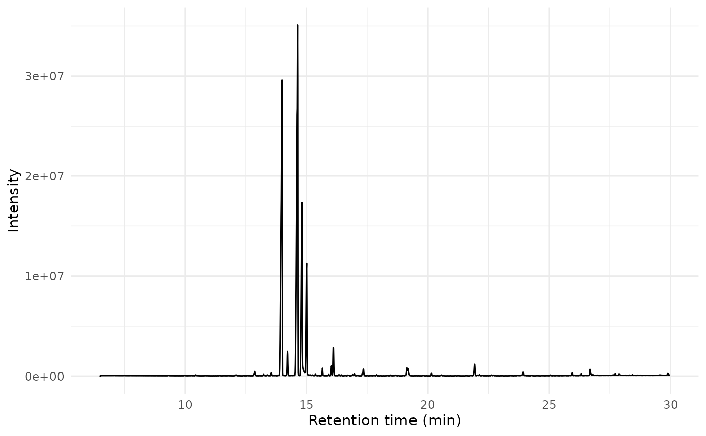
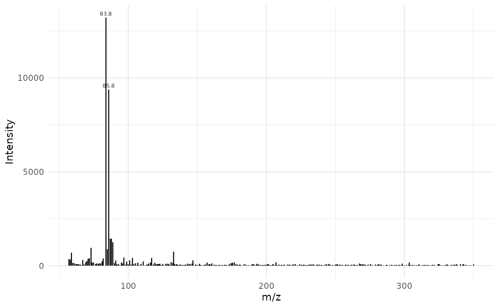

# Intro to plotting mass spectrometry data

``` r
library(chromConverter)
library(ggplot2)
library(data.table)
```

MS chromatograms are returned by default in `long` format with three
columns: retention time, m/z, and intensity.

As an example, we can load the ‘Varian’ SMS chromatogram included in the
`chromConverterExtraTests` package.

``` r
# download example Varian SMS file from the web
path_sms <- tempfile(fileext = ".sms")
download.file("https://raw.github.com/ethanbass/chromConverterExtraTests/master/inst/STRD15.SMS", destfile = path_sms)

dat <- read_chroms(path_sms, format_in = "varian_sms", format_out = "data.frame")
#> Downloading uv...Done!
```

### Plot TIC and mass spectra use base R syntax

``` r
x <- dat[[1]]$MS1

# derive TIC using aggregate
tic <- aggregate(intensity ~ rt, data = x, FUN = sum)

# plot TIC
matplot(tic$rt, tic$intensity, type = 'l',
        ylab = "Total intensity", xlab = "Time (min)")
```


Here is a simple plot function you could use to plot mass spectra using
base R graphics:

``` r
plot_spec <- function(spec, lab_int=0.2, digits=1){
  plot(spec, type = "h", xlab = "m/z", ylab = "Intensity")
  lab.idx <- which(spec$intensity > lab_int * max(spec$intensity))
  text(spec$mz[lab.idx], spec$intensity[lab.idx], round(spec$mz[lab.idx], 
                    digits), offset = 0.25, pos = 3, cex = 0.5)
}
```

Mass spectra can be extracted by filtering on the time column. For
example to get the mass spectrum of the first scan:

``` r
times <- unique(x$rt)
spec <- x[x$rt == times[100], -1]
plot_spec(spec)
```


### Plot TIC and mass spectra using *dplyr* syntax

Plot TIC with dplyr:

``` r
tic <- x |> dplyr::group_by(rt) |> dplyr::summarize_at("intensity", sum)

plot(intensity ~ rt, data=tic, type = 'l',
        ylab = "Total intensity", xlab = "Time (min)")
```


Plot spectrum with dplyr:

``` r
dplyr::filter(x, rt == 7.26355) |> 
  dplyr::select(mz, intensity) |> 
  plot_spec()
```


### Plot TIC and mass spectra using *data.table* syntax

Convert to `data.table`:

``` r
x <- data.table::as.data.table(x)
```

chromConverter can also return chromatograms in data.table format
directly:

``` r
dat <- read_chroms(path_sms, format_in = "varian_sms", format_out = "data.table")
```

Extract the total ion chromatogram:

``` r
tic <- x[, .(intensity = sum(intensity)), by = rt]
matplot(tic$rt, tic$intensity, type = 'l',
        ylab = "Total intensity", xlab = "Time (min)")
```


Extract the base ion chromatogram:

``` r
bpc <- x[, .(intensity = max(intensity)), by = rt]
matplot(bpc$rt, bpc$intensity, type = 'l',
        ylab = "Base ion chromatogram", xlab = "Time (min)")
```


To obtain a mass spectrum we just filter by retention time as before:

``` r
plot_spec(x[rt == 7.26355, c('mz', 'intensity')])
```


### Plot TIC and mass spectra using *ggplot*

``` r
ggplot(data = tic, aes(x=rt, y=intensity)) + 
  geom_line() + 
  xlab("Retention time (min)") +
  ylab("Intensity")  +
  theme_minimal()
```



Plot mass spectrum with ggplot:

``` r
lab_int <- 0.2
digits <- 1
dplyr::filter(x, rt == 7.26355) |> 
  dplyr::select(mz, intensity) |> 
  ggplot(aes(x = mz, y = intensity)) +
  geom_segment(aes(xend = mz, yend = 0), linewidth = 0.5) +
  geom_text(data = subset(spec, intensity > lab_int * max(intensity)),
            aes(label = round(mz, digits)),
            vjust = -0.5, size = 2) +
  labs(x = "m/z", y = "Intensity") +
  theme_minimal()
```



## Session Information

``` r
sessionInfo()
#> R version 4.5.2 (2025-10-31)
#> Platform: x86_64-pc-linux-gnu
#> Running under: Ubuntu 24.04.3 LTS
#> 
#> Matrix products: default
#> BLAS:   /usr/lib/x86_64-linux-gnu/openblas-pthread/libblas.so.3 
#> LAPACK: /usr/lib/x86_64-linux-gnu/openblas-pthread/libopenblasp-r0.3.26.so;  LAPACK version 3.12.0
#> 
#> locale:
#>  [1] LC_CTYPE=C.UTF-8       LC_NUMERIC=C           LC_TIME=C.UTF-8       
#>  [4] LC_COLLATE=C.UTF-8     LC_MONETARY=C.UTF-8    LC_MESSAGES=C.UTF-8   
#>  [7] LC_PAPER=C.UTF-8       LC_NAME=C              LC_ADDRESS=C          
#> [10] LC_TELEPHONE=C         LC_MEASUREMENT=C.UTF-8 LC_IDENTIFICATION=C   
#> 
#> time zone: UTC
#> tzcode source: system (glibc)
#> 
#> attached base packages:
#> [1] stats     graphics  grDevices utils     datasets  methods   base     
#> 
#> other attached packages:
#> [1] data.table_1.17.8         ggplot2_4.0.1            
#> [3] chromConverter_0.8.0.9000
#> 
#> loaded via a namespace (and not attached):
#>  [1] rappdirs_0.3.3     sass_0.4.10        generics_0.1.4     bitops_1.0-9      
#>  [5] xml2_1.5.0         stringi_1.8.7      lattice_0.22-7     digest_0.6.39     
#>  [9] magrittr_2.0.4     evaluate_1.0.5     grid_4.5.2         RColorBrewer_1.1-3
#> [13] fastmap_1.2.0      rprojroot_2.1.1    cellranger_1.1.0   jsonlite_2.0.0    
#> [17] Matrix_1.7-4       purrr_1.2.0        scales_1.4.0       RaMS_1.4.3        
#> [21] pbapply_1.7-4      textshaping_1.0.4  jquerylib_0.1.4    cli_3.6.5         
#> [25] rlang_1.1.6        bit64_4.6.0-1      withr_3.0.2        base64enc_0.1-3   
#> [29] cachem_1.1.0       yaml_2.3.10        parallel_4.5.2     tools_4.5.2       
#> [33] dplyr_1.1.4        here_1.0.2         reticulate_1.44.1  vctrs_0.6.5       
#> [37] R6_2.6.1           png_0.1-8          lifecycle_1.0.4    stringr_1.6.0     
#> [41] fs_1.6.6           bit_4.6.0          ragg_1.5.0         pkgconfig_2.0.3   
#> [45] desc_1.4.3         pkgdown_2.2.0      bslib_0.9.0        pillar_1.11.1     
#> [49] gtable_0.3.6       glue_1.8.0         Rcpp_1.1.0         systemfonts_1.3.1 
#> [53] tidyselect_1.2.1   xfun_0.54          tibble_3.3.0       knitr_1.50        
#> [57] farver_2.1.2       htmltools_0.5.8.1  labeling_0.4.3     rmarkdown_2.30    
#> [61] compiler_4.5.2     entab_0.3.1        S7_0.2.1           readxl_1.4.5
```
